# NeuroFleet

### Wichtigste Links & URL

| Name                            | URL                                                                                 |
| ------------------------------- | ----------------------------------------------------------------------------------- |
| Deployte Applikation            | [Azure Deployment](https://zhaw-project-strubili.azurewebsites.net/)                |
| Code                            | [GitHub Repository](https://github.com/ISxOdin/neurofleet)                          |
| Postman Dokumentation           | [Postman_Documentation](https://documenter.getpostman.com/view/40518505/2sB2j1gBvr) |
| Roadmap-History                 | [History](https://github.com/users/ISxOdin/projects/2/views/7)                      |
| Chart mit Iterations und Labels | [Iterations](https://github.com/users/ISxOdin/projects/2/insights/2)                |
| SonarCloud                      | [Statische Analyse](https://sonarcloud.io/dashboard?id=zhaw-strubili_neurofleetok)  |

Was sind die Kernideen?

1. KI-gestützte Transportkapazitätsprognose
   - Maschinelles Lernen analysiert vergangene Sendungen, Wetter & Verkehr, um zukünftige Engpässe vorherzusagen.
   - Mit Hilfe von ML-Modellen, Kapazitätsengpässe vorhersehen.
2. Automatische Routenoptimierung
   - Echtzeitdaten helfen, die beste Route basierend auf Verkehr, Mautgebühren oder Umweltfaktoren zu berechnen.
   - Nutzung von Google Maps API oder OpenStreetMap für smarte Wegfindung.
3. Kapazitäts- und Frachtplanung mit KI
   - KI schlägt vor, welche Ladung auf welche Fahrzeuge verteilt werden sollte.
   - Reduzierung von Leerfahrten durch smarte Ladungsoptimierung.
4. Echtzeit-Sichtbarkeit & Visualisierung
   - Live-Dashboards mit Heatmaps für Engpässe.
   - Simulationen für verschiedene Transport-Szenarien.

Echtzeitdaten sind für den Anfang Out of Scope.

# Inhaltsverzeichnis

- [Einleitung](#einleitung)
  - [Explore-Board](#explore-board)
  - [Create-Board](#create-board)
  - [Evaluate-Board](#evaluate-board)
  - [Diskussion Feedback Pitch](#diskussion-feedback-pitch)
- [Anforderungen](#anforderungen)
  - [Use-Case Diagramm](#use-case-diagramm)
  - [Use-Case Beschreibung](#use-case-beschreibung)
  - [Fachliches Datenmodell](#fachliches-datenmodell)
  - [Erläuterungen zum Datenmodell](#erläuterungen-zum-datenmodell)
  - [Zustandsdiagramm](#zustandsdiagramm)
  - [UI-Mockup](#ui-mockup)
- [Implementation](#implementation)
  - [Frontend](#frontend)
  - [KI-Funktionen](#ki-funktionen)
- [Fazit](#fazit)
  - [Stand der Implementation](#stand-der-implementation)

# Einleitung

## Explore-Board

### TRENDS & TECHNOLOGIE

- **Megatrends:** Digitalisierung, Automatisierung, Nachhaltigkeit, Urbanisierung
- **Technologische Entwicklungen:** KI-gestützte Routenplanung, Predictive Analytics, IoT-basierte Fahrzeugüberwachung
- **Soziokulturelle Trends:** Sharing Economy, Umweltbewusstsein, steigende Nachfrage nach On-Demand-Logistik
- **Konsum- und Zeitgeisttrends:** Effizienzsteigerung in der Logistik, steigende E-Commerce-Bedürfnisse, autonome Fahrzeuge
- **Digitale Innovationen:** Cloud-basierte Flottenmanagement-Systeme

### POTENTIELLE PARTNER & WETTBEWERB

- **Potenzielle Partner:** Logistikdienstleister, Speditionen, Technologieanbieter für KI und IoT, Universitäten mit Forschung zu Transport und KI
- **Wettbewerber:** SAP Transportation Management, Transporeon, Sennder, FourKites, Project44
- **Marktentwicklung:** Wachsende Nachfrage nach intelligenter Transportplanung, zunehmende Vernetzung von Logistiksystemen

### FAKTEN

- NeuroFleet ist ein Prototyp-Projekt mit 150 Stunden Entwicklungszeit
- Fokus auf Simulation statt Echtzeit-Datenintegration
- Einsatz von Mock-Daten für Kapazitätsplanung
- Hauptnutzer: Logistikunternehmen mit mehreren Standorten, wobei der Fokus auf Lastwagentransport liegt
- Kombination aus KI, Simulation und Datenanalyse für optimierte Transportkapazitäten

### POTENZIALFELDER

- Optimierung von Flottenauslastung
- Einsatz von KI zur Kapazitätsverteilung
- Automatisierte Entscheidungsunterstützung für Disponenten
- Dynamische Anpassung der Kapazitätsplanung an veränderte Marktbedingungen

### USER

- **Primäre Zielgruppe:** Transport- und Logistikunternehmen
- **Sekundäre Zielgruppe:** Disponenten, Fuhrparkmanager, strategische Planer
- **Mögliche Stakeholder:** IT-Abteilungen, Geschäftsführung, Kunden der Logistikunternehmen

### BEDÜRFNISSE

- Effizientere Nutzung von Flottenkapazitäten
- Reduzierung von Leerfahrten und Ressourcenverschwendung
- Optimierte Kapazitätsverteilung durch KI-basierte Entscheidungen
- Intuitive Benutzeroberfläche zur schnellen Entscheidungsfindung

### ERKENNTNISSE

- Disponenten benötigen einfache, visuelle Dashboards für schnelle Entscheidungen
- Logistikunternehmen stehen unter wachsendem Kostendruck
- Die Transportbranche leidet unter Fahrermangel und ineffizienter Kapazitätsnutzung
- Datenbasierte Entscheidungsfindung wird immer wichtiger

### TOUCHPOINTS

- Web-Dashboard für Flottenmanagement\*\*
- Benachrichtigungen und Vorschläge für optimierte Kapazitätsverteilung
- Schnittstellen zur Nutzung von Mock-Daten für Simulationen

### WIE KÖNNEN WIR?

- Wie können wir Transportkapazitäten so optimieren, dass Unternehmen Leerfahrten vermeiden und gleichzeitig flexibel auf Marktveränderungen reagieren können?
- Wie können wir Disponenten eine intuitive Möglichkeit bieten, ihre Kapazitäten effizienter zu verteilen und Ressourcen bestmöglich zu nutzen?
- Wie können wir durch KI-gestützte Simulationen eine möglichst realitätsnahe Kapazitätsplanung ermöglichen?

## Create-Board

### IDEEN-BESCHREIBUNG

NeuroFleet ist eine KI-gestützte Plattform zur Optimierung der Transportkapazitäten in Logistikunternehmen. Sie nutzt Simulationen und vorausschauende Analysen, um eine intelligente Kapazitätsverteilung zu ermöglichen und Leerfahrten zu reduzieren. Die Plattform basiert vollständig auf Mock-Daten und bietet eine intuitive Benutzeroberfläche für Disponenten.

### ADRESSIERTE NUTZER

Logistikunternehmen mit mehreren Standorten

Disponenten und Flottenmanager

Strategische Planer für Kapazitätsmanagement

IT-Abteilungen und Digitalisierungsbeauftragte

### ADRESSIERTE BEDÜRFNISSE

Optimale Verteilung der vorhandenen Transportkapazitäten

Reduktion von Leerfahrten und ineffizienter Nutzung von Ressourcen

Dynamische Anpassung der Kapazitätsplanung an veränderte Marktbedingungen

Effiziente Disposition ohne hohe Integrationsaufwände

### PROBLEME

1. Ineffiziente Kapazitätsnutzung: Unternehmen nutzen ihre Transportressourcen nicht optimal, was zu hohen Kosten und ungenutzten Kapazitäten führt.
2. Hohes Mass an Leerfahrten: Lkw und Transportkapazitäten werden nicht effizient ausgelastet, was Kosten verursacht und die Umwelt belastet.
3. Komplexe Entscheidungsprozesse: Disponenten stehen vor der Herausforderung, Kapazitäten manuell und ineffizient zuzuweisen.

### IDEENPOTENZIAL

**Mehrwert: Mückenstich vs. Hai-Attacke**

🔵🔵🔵⚪️⚪️⚪️⚪️⚪️⚪️⚪️  
(Mittelmässiger Schmerzpunkt, aber relevant für Effizienzsteigerung)

**Übertragbarkeit: Robinson Crusoe vs. die Welt**

🔵🔵🔵🔵🔵⚪️⚪️⚪️⚪️⚪️  
(Gutes Potenzial zur Skalierung auf viele Logistikunternehmen)

**Machbarkeit: Hammer vs. Raumschiff**

🔵🔵🔵🔵🔵🔵🔵🔵⚪️⚪️  
(Technisch umsetzbar mit vorhandenen Technologien)

### DAS WOW

NeuroFleet bietet eine vollständig KI-gesteuerte Kapazitätsverteilung, die ohne komplexe menschliche Eingriffe funktioniert. Unternehmen erhalten innerhalb von Minuten eine optimierte Verteilung ihrer Flottenkapazitäten basierend auf dynamischen Simulationsmodellen.

### HIGH-LEVEL-KONZEPT

„Das Tetris für Transportkapazitäten“ - NeuroFleet nutzt KI, um Transportkapazitäten so effizient zu „stapeln“, dass keine Leerflächen entstehen – genau wie im perfekten Tetris-Spiel.

### WERTVERSPRECHEN

NeuroFleet ermöglicht Logistikunternehmen eine intelligente, KI-gestützte Kapazitätsverteilung. Durch die Simulation verschiedener Szenarien und die automatische Optimierung von Transportressourcen werden Leerfahrten minimiert, die Auslastung maximiert und CO₂-Emissionen reduziert. Unsere Plattform sorgt dafür, dass die richtigen Kapazitäten zur richtigen Zeit am richtigen Ort sind – ohne zeitaufwändige manuelle Planung.

## **Evaluate-Board**

### KANÄLE

Die NutzerInnen sollen über verschiedene digitale und analoge Kanäle erreicht werden, um eine breite Zielgruppe zu erreichen und die Verbreitung der Lösung sicherzustellen. Dazu gehören:

- **LinkedIn** – Fachbeiträge und gezieltes B2B-Marketing für Logistikunternehmen und Entscheidungsträger.
- **Google Ads & SEO** – Optimierung der Webpräsenz für gezielte Suchanfragen im Bereich Transportoptimierung.
- **Messen & Fachkonferenzen** – Präsentation auf Logistik- und Transportmessen zur direkten Kundenansprache.
- **E-Mail-Marketing** – Gezielte Kampagnen für potenzielle Unternehmenskunden mit Use Cases und Erfolgsstories.
- **Webinare & Demos** – Regelmässige Online-Veranstaltungen zur Vorstellung von Funktionen und Vorteilen der Lösung.
- **Partnerschaften mit Logistikverbänden** – Zusammenarbeit mit Branchennetzwerken zur Steigerung der Bekanntheit.

### UNFAIRER VORTEIL

Die Lösung bietet folgende Alleinstellungsmerkmale, die schwer oder gar nicht kopierbar sind:

- **KI-gestützte Optimierung**: Selbstlernende Algorithmen analysieren kontinuierlich Transportdaten und verbessern die Effizienz.
- **Simulationen für Kapazitätsauslastung**: Vergleich verschiedener Szenarien zur besseren Entscheidungsfindung.
- **Dynamische Disposition**: Automatische Neuzuweisung von Transportkapazitäten in Echtzeit.
- **Benutzerfreundlichkeit**: Intuitives Dashboard für schnelle Analyse und Anpassung von Kapazitätsplänen.

### KPI

Zur Erfolgsmessung der Lösung werden folgende KPIs verwendet:

- **Nutzerwachstum**: Anzahl der registrierten Unternehmen und aktiven Nutzer.
- **Kapazitätsauslastung**: Durchschnittlicher Anstieg der Transportauslastung durch Nutzung der Lösung.
- **Reduktion von Leerfahrten**: Prozentuale Abnahme der Leerfahrten pro Unternehmen.
- **Kosteneinsparungen**: Durchschnittliche Kostenreduktion durch optimierte Transporte.
- **CO₂-Einsparung**: Reduktion des CO₂-Ausstosses durch effizientere Routenplanung.
- **Kundenzufriedenheit**: Net Promoter Score (NPS) basierend auf Kundenfeedback.

### EINNAHMEQUELLEN

Die Monetarisierung erfolgt über verschiedene Einnahmemodelle:

- **Lizenzbasierte Abonnements**: Monatliche oder jährliche Gebühren für Unternehmen mit verschiedenen Nutzungsplänen.
- **Enterprise-Lösungen**: Individuelle Anpassungen und Integrationen für Grosskunden (mindestens 100 Fahrzeugen oder >10.000 Transporten pro Monat) mit massgeschneiderten Features.
- **Datenanalyse & Insights**: Verkauf anonymisierter Datenanalysen für Markttrends und Logistikoptimierung.
- **Fördergelder & Subventionen**: Unterstützung durch Programme für nachhaltige Logistiklösungen.

## Diskussion Feedback Pitch

  <h2>Feedback zum Pitch</h2>
  
<strong>Frage 1:</strong> Wie wird KI genau umgesetzt?

  
<strong>Frage 2:</strong> Woher stammen die Daten zu den Routen? Gibt es Datenschutz bei wertvollen Transporten?

  
<strong>Frage 3:</strong> Warum wird diese Art von Optimierung nicht schon heute von Logistikunternehmen eingesetzt?

  
<strong>Frage 4:</strong> Lässt sich das System auch auf Schiff- und Zugtransport skalieren?

  
<strong>Frage 5:</strong> Wer genau nutzt die App? (Zielgruppe und Benutzerrollen)

  
<strong>Frage 6:</strong> Wie unterscheidet sich die Lösung von bestehenden Logistikplanern?

  
<strong>Frage 7:</strong> Wie präzise ist die KI bei ihren Entscheidungen?

  
<strong>Frage 8:</strong> Wie wird mit Zöllen oder länderspezifischen Anforderungen umgegangen?

  
<strong>Frage 9:</strong> Profitieren auch LKW-Besitzer von der App, oder wird eine eigene Flotte vorausgesetzt?

  
<strong>Frage 10:</strong> Können durch Routenoptimierung auch Staus vermieden werden?

  
<strong>Frage 11:</strong> Wie grenzt sich die Lösung vom Wettbewerb im Markt ab?

  
<strong>Frage 12:</strong> Ist das System auch international (grenzüberschreitend) einsetzbar?

  
<strong>Kommentar:</strong> Sehr gut visualisiert, überzeugend präsentiert, keine Kritik.

# Anforderungen

## Use-Case Diagramm

## Use-Case Beschreibung

**Rollenbeschreibung:**

`User`: Standard Rolle jedes Nutzers, der sich frisch registriert hat. Diesem wird eine Rolle und eine Firma zugeteilt. Der Nutzer hat ansonsten keinen Nutzen.

`Driver`: Dem Driver sollte zukünftig Routen und Fahrzeuge zugewiesen werden. Diese Funktion ist jedoch out-of-scope.

`Fleetmanager`: Der Fleetmanager hat eine Company und Location. Er kann neue Fahrzeuge für seine Location registrieren, Jobs erstellen und Routen erstellen. Die Route können aber nur mit Fahrzeugen erstellt werden, die seiner Location gehören.

`Owner`: Der Owner kann neue Locations erstellen. Er hat die Berechtigung Nutzern neue Rollen zuzuteilen. Ansonsten hat er die selben Rechte, wie der Fleetmanager.

`Admin`: Der Admin hat alle Rechte. Er kann Companies erstellen und für jede Company jeweils Locations, Vehicles, Jobs und Routen erstellen.

**UC-Beschreibung:**

<table> <thead> <h3>Manage Company</h3><tr><th>Item</th><th>Description</th></tr> </thead> <tbody> <tr><td><strong>ID</strong></td><td>UC01</td></tr> <tr><td><strong>Title</strong></td><td>Manage Company</td></tr> <tr><td><strong>Actors</strong></td><td>Admin</td></tr> <tr><td><strong>Standard Flow</strong></td> <td> <ol> <li>Admin ruft die Übersicht der registrierten Unternehmen auf.</li> <li>Admin wählt, ob ein Unternehmen erstellt, bearbeitet oder gelöscht werden soll.</li> <li>Das System zeigt das entsprechende Eingabeformular an.</li> <li>Admin gibt Firmendetails ein oder ändert sie (Name, E-Mail, Adresse).</li> <li>Das System validiert die Eingaben, speichert sie und zeigt eine Bestätigung.</li> </ol> </td> </tr> <tr><td><strong>Exceptions</strong></td> <td> <ul> <li>Pflichtfelder fehlen oder sind ungültig → Validierungsfehler anzeigen.</li> </ul> </td> </tr> <tr><td><strong>Data Definitions</strong></td> <td>Ein Unternehmen enthält Name, E-Mail-Adresse und Geodaten (über Geocoding).</td> </tr> </tbody> </table>
  

<table> <thead> <h3>Manage Location</h3><tr><th>Item</th><th>Description</th></tr> </thead> <tbody> <tr><td><strong>ID</strong></td><td>UC02</td></tr> <tr><td><strong>Title</strong></td><td>Manage Locations</td></tr> <tr><td><strong>Actors</strong></td><td>Admin, Owner</td></tr> <tr><td><strong>Standard Flow</strong></td> <td> <ol> <li>Benutzer ruft die Standortverwaltung auf.</li> <li>System zeigt eine Liste aller zugeordneten Standorte (z. B. Depots, Lagerhallen, Kunden).</li> <li>Benutzer wählt „Standort erstellen“, „bearbeiten“ oder „löschen“.</li> <li>System öffnet das Eingabeformular mit Feldern wie Name, Adresse (ggf. Company)</li> <li>Änderungen werden gespeichert und visuell bestätigt.</li> </ol> </td> </tr> <tr><td><strong>Exceptions</strong></td> <td> <ul> <li>Ungültige Adresse → Validierung schlägt fehl (durch Geocoding-Dienst).</li> </ul> </td> </tr> <tr><td><strong>Data Definitions</strong></td> <td>Ein Standort besteht aus Name, Adresse Geokoordinaten, Fleet Manager und Firma</td> </tr> </tbody> </table>
  

<table> <thead> <h3>Manage Vehicle</h3><tr><th>Item</th><th>Description</th></tr> </thead> <tbody> <tr><td>ID</td><td>UC03</td></tr> <tr><td>Title</td><td>Manage Vehicle</td></tr> <tr><td>Actors</td><td>Fleet Manager, Owner</td></tr> <tr><td>Standard Flow</td><td>1. Benutzer wählt „Fahrzeug erstellen“, „bearbeiten“ oder „löschen“. 2. System zeigt Maske zur Eingabe von Daten. 3. Änderungen werden gespeichert.</td></tr> <tr><td>Exceptions</td><td>- Fahrzeug-ID bereits vergeben → Warnung. - Fahrzeug wird aktuell verwendet → Löschen verweigert.  - VIN nummer entspricht nicht den Anforderungen (17 Zeichen, kein I, O oder Q)</td></tr> <tr><td>Data Definitions</td><td>Fahrzeugdaten umfassen Nummernschild, VIN, Typ, Kapazität, Firma und Standort</td></tr> </tbody> </table>
  

<table> <thead>   <h3>Manage Job</h3>
 <tr><th>Item</th><th>Description</th></tr> </thead> <tbody> <tr><td>ID</td><td>UC04</td></tr> <tr><td>Title</td><td>Manage Job</td></tr> <tr><td>Actors</td><td>Fleet Manager, Owner</td></tr> <tr><td>Standard Flow</td><td>1. Benutzer wählt „Job erstellen“, „bearbeiten“ oder „löschen“ aus. 2. System zeigt Eingabemaske für Jobdetails. 3. Benutzer gibt oder ändert Informationen. 4. System speichert und bestätigt. 5. KI optimiert Beschreibung</td></tr> <tr><td>Exceptions</td><td>- Ungültige Eingaben (z. B. negative Vergütung) → Fehlermeldung. - Unbekannte Company → Verknüpfung verweigert.</td></tr> <tr><td>Data Definitions</td><td>Ein Job enthält Beschreibung, geplante Zeit, Firma, Abfahrtsort, Ankunftsort, Ladung in Kg</td></tr> </tbody> </table>
  

<table> <thead><h3>Manage Route</h3> <tr><th>Item</th><th>Description</th></tr> </thead> <tbody> <tr><td>ID</td><td>UC05</td></tr> <tr><td>Title</td><td>Manage Route</td></tr> <tr><td>Actors</td><td>Admin, Owner, Fleet Manager</td></tr> <tr><td>Standard Flow</td><td>1. Benutzer gibt Start- und Zielort ein. 2. System zeigt Verbindungen. 3. KI generiert Beschreibung (optional). 4. Route wird gespeichert.</td></tr> <tr><td>Exceptions</td><td>- Ungültige Adressen → Vorschläge. - Keine Verbindung → Warnung.</td></tr> <tr><td>Data Definitions</td><td>Route besteht aus Beschreibung, geplante Zeit, Firma, Fahrzeug, Jobs, Zwischenstopps</td></tr> </tbody> </table>
  
<table> 
   <thead> 
   <h3>Interact with Chatbot</h3>
   <tr>
      <th>Item</th>
      <th>Description</th>
   </tr> 
   </thead> 
   <tbody> 
      <tr>
         <td>ID</td>
         <td>UC06</td>
      </tr> 
      <tr>
         <td>Title</td>
         <td>Interact with Chatbot</td>
      </tr> 
      <tr>
         <td>Actors</td>
         <td>Admin, Owner, Fleet Manager</td>
      </tr> 
      <tr>
         <td>Standard Flow</td>
         <td>1. Benutzer öffnet Chat. 2. Frage wird gestellt (z. B. „Wie können aktuelle Routen optimiert werden“). 3. Company ID und Location ID werden mitgegeben. 4. KI verarbeitet Anfrage und liefert Antwort.</td>
      </tr> 
      <tr>
         <td>Exceptions</td>
         <td>- Unklare Formulierung → Rückfrage der KI. - Kein passender Kontext → Info-Hinweis.</td>
      </tr> 
      <tr>
         <td>Data Definitions</td>
         <td>Verwendung von Spring AI und RAG zur Kontexterweiterung mit aktuellen DB-Daten.</td>
      <tr> 
   </tbody> 
</table>
  

<table> <thead>    <h3>Dashboard</h3>
<tr><th>Item</th><th>Description</th></tr> </thead> <tbody> <tr><td><strong>ID</strong></td><td>UC05</td></tr> <tr><td><strong>Title</strong></td><td>View Dashboard</td></tr> <tr><td><strong>Actors</strong></td><td>Fleet Manager</td></tr> <tr><td><strong>Standard Flow</strong></td> <td> <ol> <li>Benutzer öffnet das Dashboard.</li> <li>System lädt Statistiken zur Auslastung, Fahrzeugstatus, geplante Jobs, laufende Jobs, erledigte Jobs, Routen und Alrts etc.</li> </ol> </td> </tr> <tr><td><strong>Exceptions</strong></td> <td> <ul> <li>Keine Daten für gewählten Zeitraum vorhanden → Hinweis anzeigen.</li> </ul> </td> </tr> <tr><td><strong>Data Definitions</strong></td> <td>Das Dashboard visualisiert aggregierte Daten aus Simulationen, KI-Auswertung und MongoDB. Die KI Auswertung rechnet die Routenauslastung und anzahl offener Jobs</td> </tr> </tbody> </table>

## Fachliches Datenmodell

## Erläuterungen zum Datenmodell

**Company (Unternehmen)**

- Zentrale Organisationseinheit
- Verwaltet Benutzer, Fahrzeuge, Standorte und Aufträge
- Identifiziert durch Name, Adresse und Koordinaten

**Vehicle (Fahrzeug)**

- Transportmittel für Routen
- Hat Kennzeichen, VIN und Kapazität
- Besitzt Status (verfügbar/nicht verfügbar) und Typ

**Route (Route)**

- Transportplan für mehrere Aufträge
- Verbindet Aufträge zu einer logischen Einheit
- Enthält Zeitplan und Gesamtgewicht der Ladung

**Job (Auftrag)**

- Einzelner Transportauftrag
- Definiert Start und Ziel
- Beinhaltet Ladungsgewicht und Zeitplan

**Location (Standort)**

- Physischer Ort für Start/Ziel von Aufträgen
- Definiert durch Name, Adresse und Koordinaten
- Kann Basis für Fahrzeuge sein

**User (Benutzer)**

- Systembenutzer mit Auth0-Authentifizierung
- Zugeordnet zu einem Unternehmen
- Verwaltet durch E-Mail und Name

## Zustandsdiagramm

> Hier das Zustandsdiagramm einbinden für diejenige Entität(en), welche mehrere Zustände durchläuft mit Events, Effects und Guards.

## UI-Mockup

[Figma Link](https://www.figma.com/proto/HXADeWdARjWyuPwI7rRJwC/NeuroFleet-Mockup?node-id=0-1&t=kFJGtDqYuxMPDniw-1)

<iframe style="border: 1px solid rgba(0, 0, 0, 0.1);" width="800" height="450" src="https://embed.figma.com/design/HXADeWdARjWyuPwI7rRJwC/NeuroFleet-Mockup?node-id=0-1&embed-host=share" allowfullscreen></iframe>

# Implementation

## Frontend

### Authentication

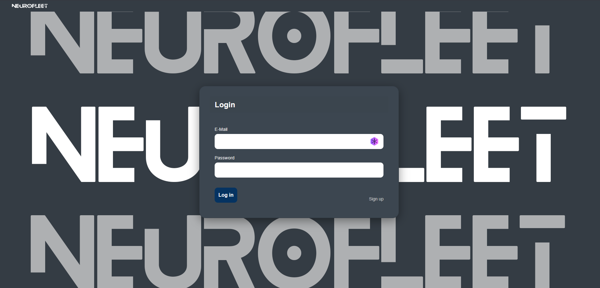

Die Login Seite.

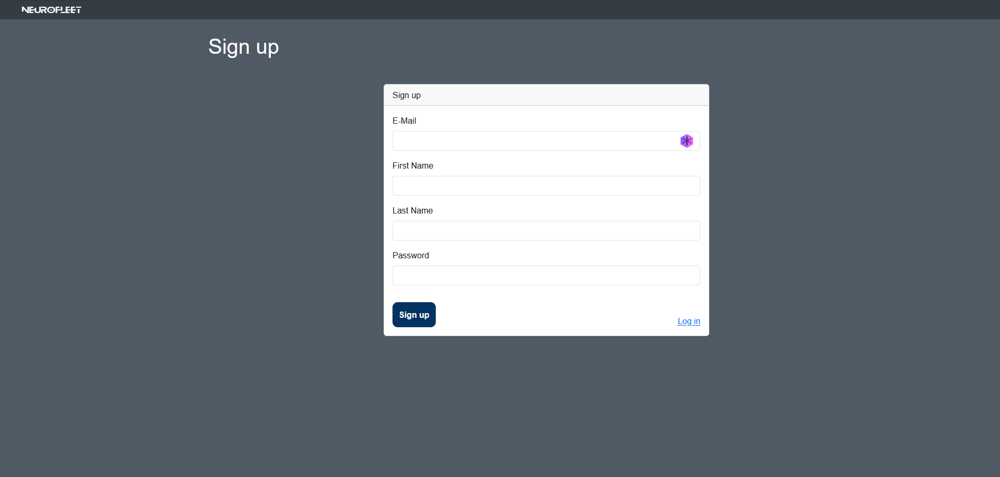

Die Regstrierungsseite. Im Signup-Prozess wird die Email geprüft, ob diese "disposable" ist.

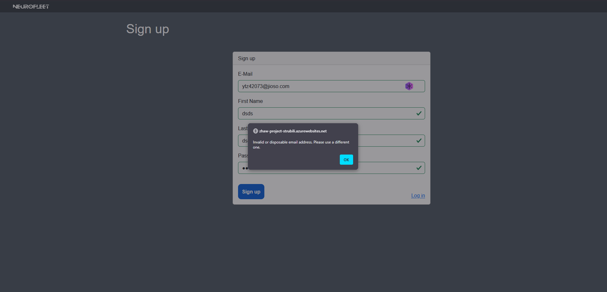

Eine nicht legitime Mail gibt einen Fehler zurück.

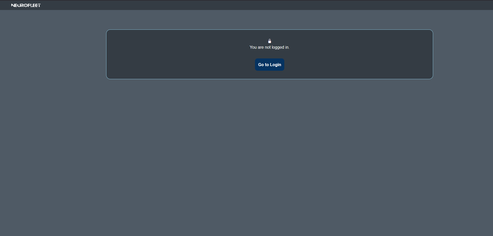

Wenn sich ein User ausloggt, erhält er die "Not logged in" Seite.

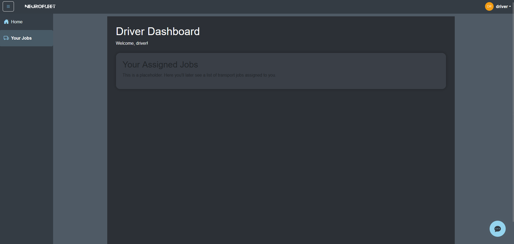

Ein Driver sieht nur diese Seite. Jobs zu einem Driver zu assignen, war jedoch out-of-scope.

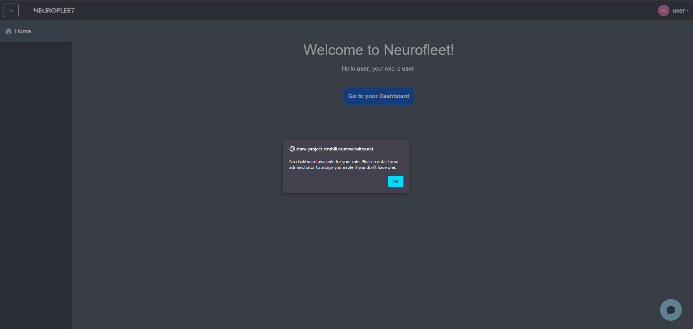

Ein User hat keine Rechte und muss darauf warten eine Rolle zu erhalten.

### Home

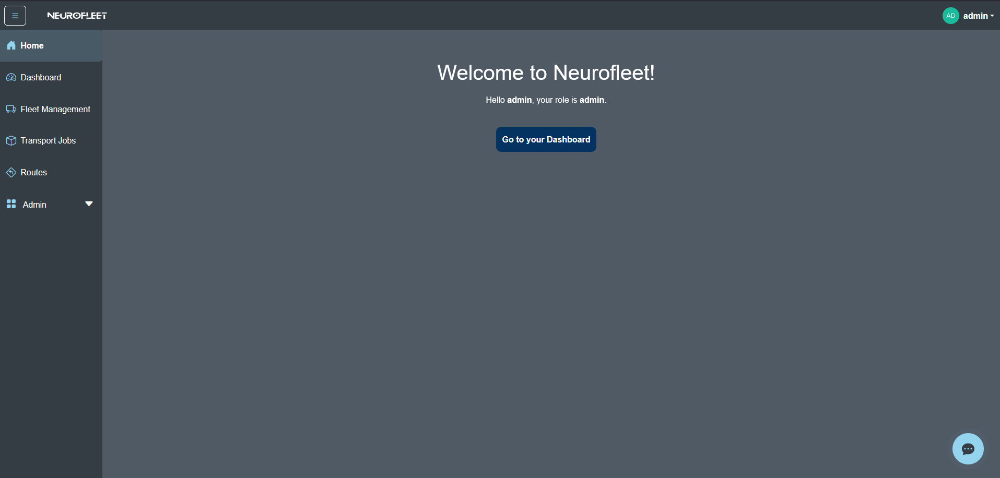

Die Homepage zeigt den Nicknamen und die Rolle an.

### Profile

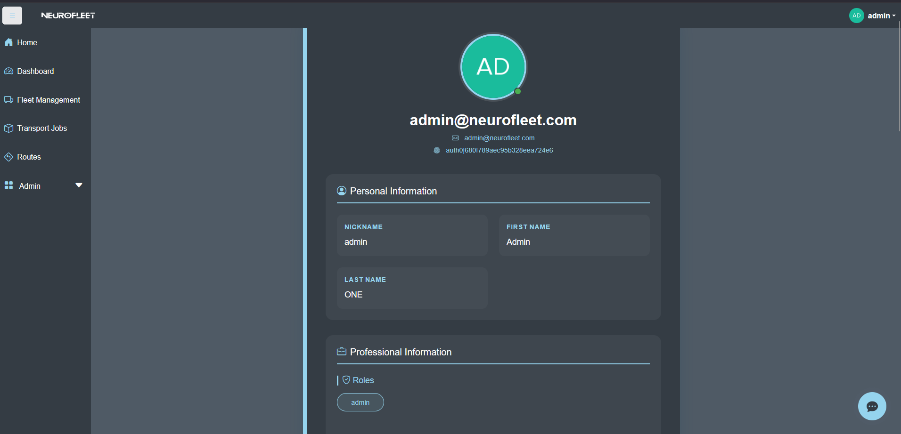

Auf der Profilseite kann persönliche Information aufgerufen werden.

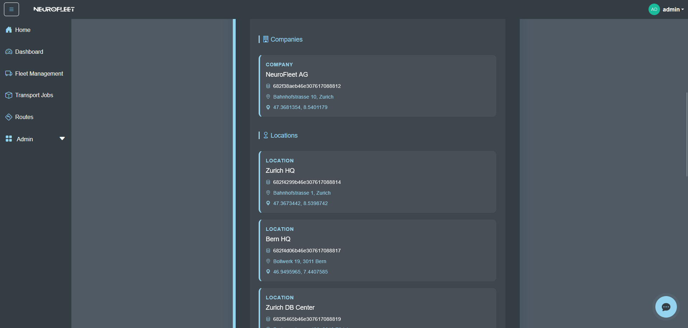

Auf der Profilseite kann profesionelle Information aufgerufen werden.

## Fleetmanager +

Diese Seiten können von Admin, Owner und Fleetmanager angesehen werden.
Admin sieht und kann alles.
Owner sieht nur seine Company, aber alle Locations.
Fleetmanager sieht nur seine Company und die Location, die ihm zugeteilt wurde.

### Dashboard

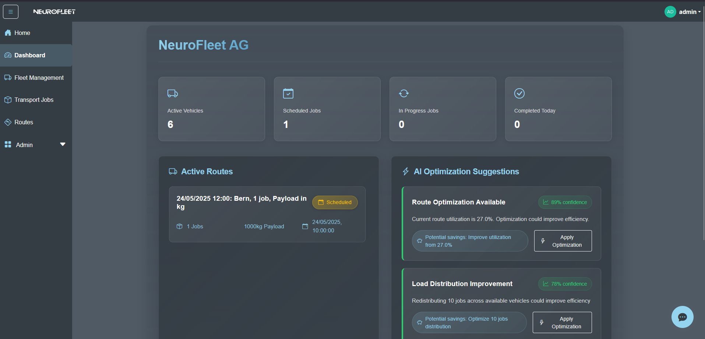

Das Dashboard zeigt verschiedenste Daten über die Jobs an. Ebenfalls werden aktive Routen (Status "SCHEDULED" und "IN PROGRESS") angezeigt. Die KI zeigt aktuelle Routenauslastung und Anzahl Jobs. Apply Optimization ist ein Platzhalter.

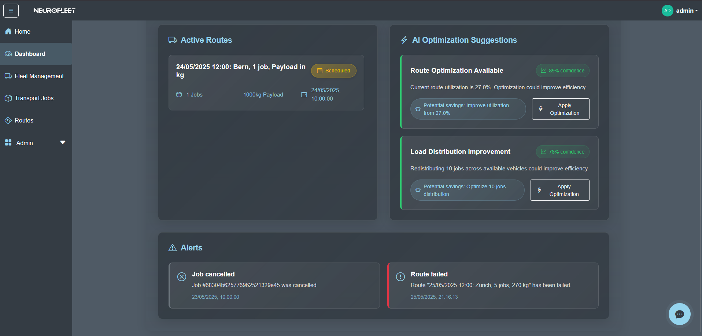

Abgebrochene Jobs und Routen (verschiedene Status: "CANCELLED, FAILED etc.) werden hier angezeigt.

### Fleet Management

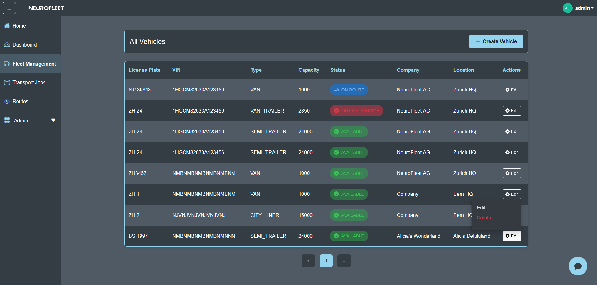

Alle Fahrzeuge werden angezeigt. Fahrzeuge können gelöscht werden.

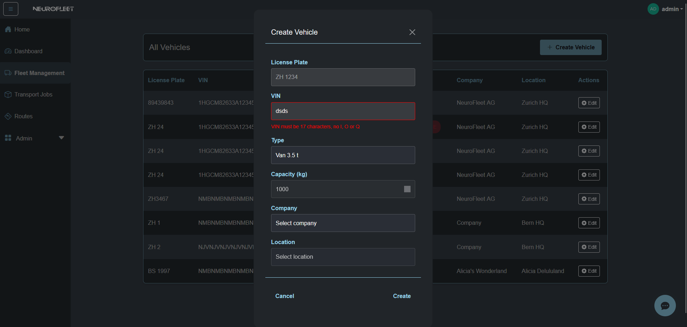

Fahrzeuge können erfasst werden, das Form checkt, ob die Syntax der VIN richtig ist, da dies ein EU Standard ist. Es kann ein Fahrzeugtyp gewählt werden, welcher eine automatische Kapazitätszuweisung macht. Fahrzeuge werden einem Standort zugewiesen.

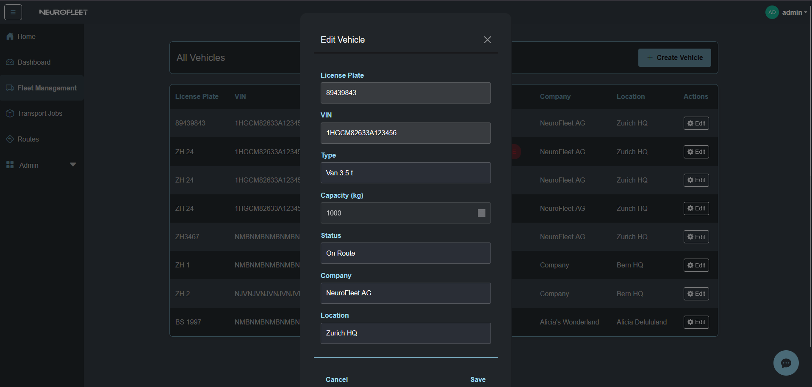

Fahrzeuge können Status' haben, welche bearbeitet werden können.

### Transport Jobs

Alle Jobs können angezeigt werden. Jobs können gelöscht werden.

Jobs können erfasst werden. Hierzu braucht es zwei registrierte Standorte (Locations).
Erfasste Jobs erhalten eine KI generierte Beschreibung

Jobs können bearbeitet werden. Jobs haben verschieden Status.

Die Jobroute kann angezeigt werden, wenn der Job angeklickt wird.

### Routes

Eine angeklickte Route zeigt alle Jobs und Waypoints, welche befahren werden müssen.

Routen können so erfasst werden, dass ein gewähltes Fahrzeug eine fixe Kapazität hat. Diese kann nicht überstiegen werden. Eine Progress Bar zeigt hier den Fortschritt an. Es werden nur Vehicles und Jobs der gewählten Company angezeigt.

Alle Status, ausser "COMPLETED" sind den Jobs synchronisiert. Also wenn eine Route "SCHEDULED" wird, hat der Job das auch. Bereits abgeschlossene Jobs, bleiben jedoch bei "COMPLETED"

## Admin

### Users

Diese Seite kann von Admin und Owner angesehen werden.

Alle User werden mit der Rolle angezeigt. Owner sieht nur seine User.

User können eine Rolle und Company zugeteilt werden. Owner kann keine Company zuweisen. User können **nicht** gelöscht werden. Dies war out-of-scope.

### Location

Diese Seite kann von Admin und Owner angesehen werden.

Alle Standorte werden angezeigt. Wenn der Standort angeklickt wird, wird eine Karte der registrierten Adresse angezeigt. Standorte können gelöscht werden.

Nach dem Erfassen des Standortes wird automatisch die Adresse geocoded. Nur der Admin kann die Company wählen

Standorte können bearbeitet werden.

### Company

Diese Seite kann nur vom Admin angesehen werden.

Alle Firmen werden angezeigt. Wenn die Firma angeklickt wird, wird eine Karte der registrierten Adresse angezeigt. Firmen können gelöscht werden.

Nach dem Erfassen der Firma wird automatisch die Adresse geocoded.

Firmen können bearbeitet werden.

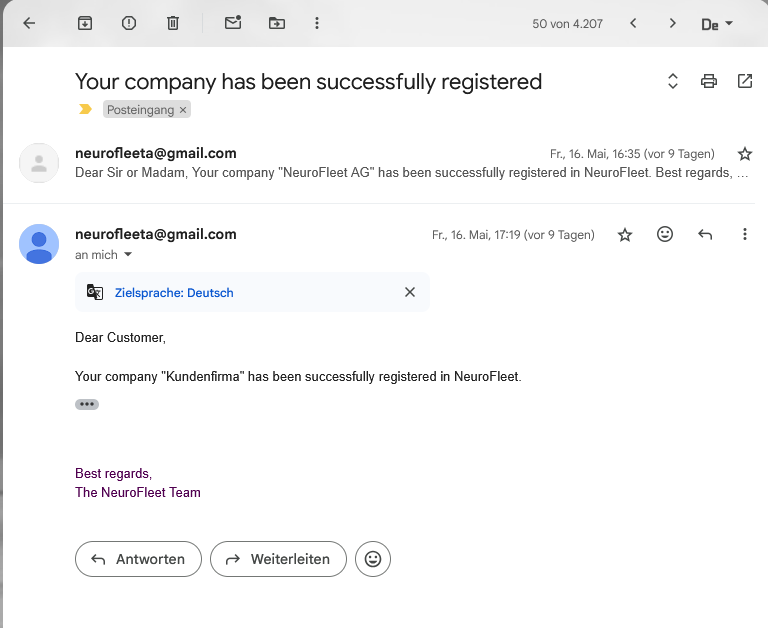

Wenn ein Owner erfasst wird erhält dieser eine Bestätigungsmail.

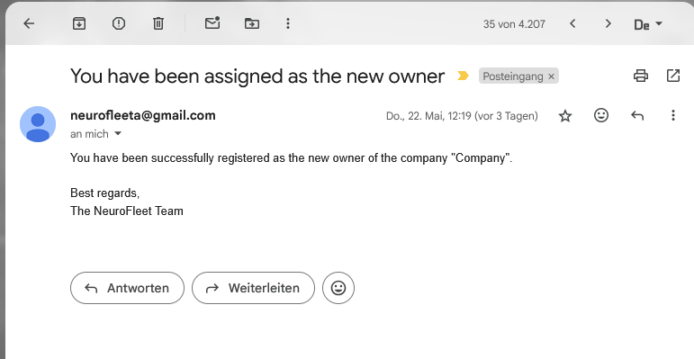

Wenn ein Owner erfasst wird erhält dieser eine Bestätigungsmail.

### Chatbot

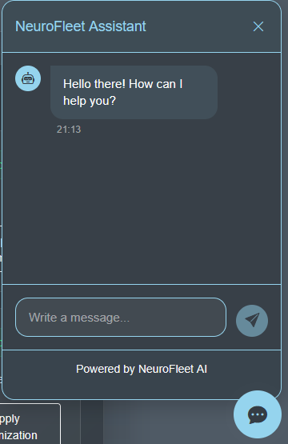

Chatbots können geöffnet werden und antworten.

Auf Anfrage mit Company und Location ID antwortet der Chatbot mit einer Optimierung.

## KI-Funktionen

Die KI wird hauptsächlich bei der Erstellung von neuen Jobs und Routen genutzt. Diese erhalten eine optimale Description, damit diese klar und verständlich sind. Zusätzlich kann ein Nutzer eine Optimization Anfrage mit Company ID und Location ID im Chatbot anfragen. Dieser gib eine Empfehlung zurück.

# Fazit

## Stand der Implementation

### Kurzzusammenfassung der Applikation

NeuroFleet ist eine Flottenmanagement-Applikation, die es Unternehmen ermöglicht:

- Ihre Fahrzeugflotte zu verwalten
- Transportaufträge zu koordinieren
- Routen zu planen und zu optimieren
- Standorte und Lieferungen zu überwachen
- Benutzer und deren Zugriffsrechte zu verwalten

### Ausbaumöglichkeiten

1. **UI/UX Verbesserungen**

   - Implementierung von Toaster-Benachrichtigungen statt Alert-Messages (#96)
   - Entwicklung einer Settings-Seite für Benutzereinstellungen (#174)
   - Implementierung eines responsiven Dashboards
   - Echtzeit-Routenplanung-Visualisierung auf einer Karte

   [Backlog](https://github.com/users/ISxOdin/projects/2/views/6)

2. **Technische Erweiterungen**

   - Entwicklung von API-Client-Bibliotheken (#166)
   - Implementierung der Fahrerzuweisung (#169)
   - Status-Management für Aufträge durch Fahrer (#170)
   - Integration von Echtzeit-Tracking-Systemen

3. **Funktionale Erweiterungen**

   - **Routenoptimierung**

     - Automatische Routenberechnung basierend auf Aufträgen
     - Berücksichtigung von Verkehrsdaten
     - Beürcksichtigung von Wetter
     - Kraftstoffverbrauchsoptimierung

   - **Fahrzeugmanagement**

     - Wartungsplanung und -erinnerungen
     - Kraftstoffverbrauchsüberwachung
     - Fahrzeugauslastungsanalyse

   - **Auftragsmanagement**

     - Automatische Auftragszuweisung
     - Priorisierung von Aufträgen
     - Kundenbenachrichtigungssystem

   - **Berichterstattung**
     - Detaillierte Analysen und Reports
     - KPI-Dashboard
     - Kostenüberwachung

4. **Integration und Automatisierung**

   - Anbindung an Buchhaltungssysteme
   - Integration von Wetter-APIs
   - Automatische Rechnungserstellung
   - Schnittstellen zu Kundensystemen

5. **Mobile Erweiterungen**

   - Fahrer-App für unterwegs (Statusänderung)
   - Mobile Auftragserfassung
   - Digitale Lieferscheine
   - Foto-Dokumentation von Lieferungen

6. **Sicherheit und Compliance**

   - Erweiterte Zugriffskontrollen
   - Audit-Logging
   - Compliance-Reporting
   - Datenschutz-Dashboard

7. **KI und Automatisierung**
   - Vorhersagemodelle für Auftragseingänge
   - Automatische Ressourcenplanung
   - Predictive Maintenance
   - Anomalieerkennung

Diese Erweiterungen würden die Applikation zu einem umfassenden Flottenmanagement-System ausbauen, das den gesamten Logistikprozess abdeckt und optimiert.
